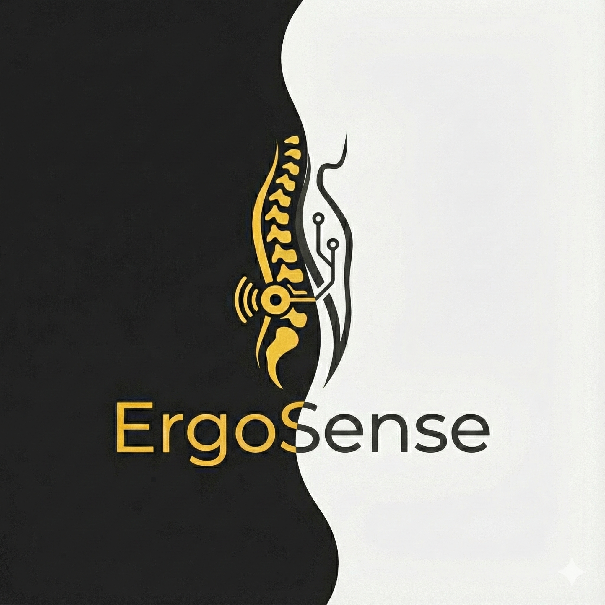

# ErgoSense App 🧘‍♂️📱

**ErgoSense** es una aplicación móvil desarrollada en Flutter diseñada para mejorar tu postura y concentración. Se conecta vía Bluetooth a un dispositivo "wearable" (ESP32) que monitorea la inclinación de tu cuello en tiempo real, ayudándote a prevenir dolores y mantener hábitos saludables mediante gamificación.

---

## 🚀 Características Principales

### 📡 Conexión Inteligente
- **Monitoreo en Tiempo Real**: Conexión Bluetooth Low Energy (BLE) con el dispositivo FocusCollar.
- **Alertas de Postura**: Detecta cuando tu cuello supera el ángulo umbral (ej. 15°) y te notifica para corregirlo.
- **Calibración Personalizada**: Ajusta el ángulo base según tu comodidad.

### 🎮 Gamificación y Recompensas
- **Sistema de Puntos**: Gana puntos por cada minuto de buena postura.
- **Rachas y Tendencias**: Visualiza tu progreso diario y semanal con gráficas detalladas.
- **Tienda de Recompensas**: Canjea tus puntos por beneficios reales o virtuales.

### 📊 Dashboard Completo
- **Estadísticas en Vivo**: Visualiza tu ángulo actual, tiempo de sesión y alertas.
- **Historial de Sesiones**: Revisa tu desempeño en sesiones anteriores.
- **Modo Oscuro/Claro**: Interfaz moderna y amigable.

---

## 🛠️ Tecnologías Utilizadas

- **Frontend**: [Flutter](https://flutter.dev/) (Dart)
- **Estado**: Provider + ChangeNotifier
- **Persistencia Local**: [Hive](https://docs.hivedb.dev/) (NoSQL)
- **Conectividad**: `flutter_blue_plus` (Bluetooth BLE)
- **API**: Integración REST con backend en Python/FastAPI (Render).
- **Gráficos**: Custom Painting y widgets animados.

---

## 📸 Capturas de Pantalla

| Dashboard | Tendencias | Dispositivos |
|-----------|------------|--------------|
|  |  |  |

*(Nota: Reemplaza estas rutas con capturas reales de tu app)*

---

## 🔧 Instalación y Configuración

### Prerrequisitos
- Flutter SDK (v3.0 o superior)
- Dart SDK
- Dispositivo Android/iOS o Emulador (Bluetooth requiere dispositivo físico para pruebas completas).

### Pasos
1.  **Clonar el repositorio**:
    ```bash
    git clone https://github.com/AlejandroAban09/AppPostura.git
    cd AppPostura
    ```

2.  **Instalar dependencias**:
    ```bash
    flutter pub get
    ```

3.  **Configurar Assets**:
    Asegúrate de que las imágenes y fuentes estén en la carpeta `assets/` y referenciadas en `pubspec.yaml`.

4.  **Ejecutar la App**:
    ```bash
    flutter run
    ```

---

## 🤝 Contribución

¡Las contribuciones son bienvenidas! Si tienes ideas para mejorar la detección de postura o nuevas mecánicas de juego:

1.  Haz un Fork del proyecto.
2.  Crea una rama para tu funcionalidad (`git checkout -b feature/NuevaFuncionalidad`).
3.  Haz Commit de tus cambios (`git commit -m 'Agrega nueva funcionalidad'`).
4.  Haz Push a la rama (`git push origin feature/NuevaFuncionalidad`).
5.  Abre un Pull Request.

---

## 📄 Licencia

Este proyecto está bajo la Licencia MIT - mira el archivo [LICENSE](LICENSE) para más detalles.

---

**Desarrollado con ❤️ por el equipo de FocusMe**
